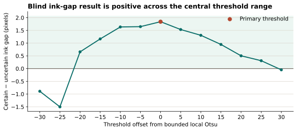

# External direct-pixel audit

## Verdict

The archived direct-pixel data support the paper's deliberately narrow claim that ZL-uncertain separators are physically narrower **in this small six-folio audit**. The result is a corroboration of the much larger coordinate analysis, not an independent manuscript-wide study and not evidence that either separator class is a lexical word boundary.

The public bundle reproduces the published summaries exactly. An additional local-height normalization and a line-matched permutation test preserve the direction. The raw page-image measurement itself is **not independently reproducible from the public bundle** because the Beinecke derivatives and three required frozen CSV inputs are absent.

## Pinned source

- Paper: Rozanova & Temerev (2026), [*A Glyph Is Not a Letter, a Token Is Not a Word, a Space Is Not a Space*](https://arxiv.org/abs/2608.17096), especially Appendix A.3.
- Public code/data: [`lrozanova/voynich-units`](https://github.com/lrozanova/voynich-units) at commit `956a7c4fc39981f4d116fa3f4edfccce6d065571`.
- Archived tables were accepted only after SHA-256 verification; checksums are stored in `external-direct-pixel-summary.json`.

## Exact reproduction

The released table has 300 candidate boundaries from six folios: 277 certain and 23 uncertain. Blind QC retained 286 (265 certain, 21 uncertain).

| Measurement | Certain | Uncertain | Certain − uncertain |
|---|---:|---:|---:|
| Direct ink gap, pixels | 4.985 | 3.143 | **+1.842 px** |
| Gap / local box height | 0.249 | 0.163 | **+0.085** |
| Locator-box gap, pixels | 4.308 | 0.711 | +3.597 px |

All five folios retaining both label classes have positive raw and height-normalized differences. The exact one-sided sign probability is 0.03125, matching the paper.

## Added line-matched check

The paper's released analysis code contains a within-line permutation design, but its main figure emphasizes pooled and per-folio summaries. I independently applied that design to both raw pixels and the already-archived local-height normalization, preserving each line's certain/uncertain counts:

| View | Matched lines | Positive lines | Equal-line mean difference | One-sided p | Two-sided p |
|---|---:|---:|---:|---:|---:|
| Raw pixels | 18 | 13 | +2.673 px | 0.00258 | 0.01324 |
| Gap / local box height | 18 | 14 | +0.1246 | 0.00600 | 0.02134 |

These are fixed-seed Monte Carlo probabilities from 300,000 relabellings. They address line-level clustering and scan/text-size differences inside this audit; they do not enlarge the five-folio replication base.

## Robustness and boundaries

- The sign is positive at every threshold offset from −20 through +25 around the bounded local Otsu value. It reverses at the three most extreme tested offsets (−30, −25, +30), so “threshold robust” is warranted only for the central range.
- All six released alternative estimators have a positive pooled difference, but the vertical-overlap-only stress test is small (+0.286 px) and positive on only 3/5 informative folios. The paper discloses this dependence on how cursive-stroke vertical support is defined.
- Only 21 retained uncertain boundaries are available, spread over five informative folios. The distributions overlap heavily.
- The same external token boxes locate the pixel crops. The audit verifies that the coordinate contrast is realized in visible ink; it is not segmentation-independent.



## Reproducibility defect

The public driver `analysis/direct_pixel/measure_direct_pixels.py` requires a frozen blind manifest and page scans. The public repository at the pinned commit contains neither the scans nor these CSVs:

- `sample_manifest_blind.csv`
- `qc_decisions_blind.csv`
- `sample_key.csv`

The omission is more than the documented Yale-image licensing limitation: even a researcher who separately obtains the scans cannot reconstruct the exact sampled coordinates, blind exclusions, or label reveal from the released bundle. Therefore this project reproduces the **archived measurement analysis**, not the raw ink extraction or claimed blinding sequence.

## Reproduction

From this repository root, either supply the pinned external checkout or allow the script to download the three checksum-pinned archived tables:

```bash
python data/scripts/external_direct_pixel_audit.py --external-root /path/to/voynich-units
python data/scripts/plot_external_direct_pixel.py
```

Machine-readable results: `data/derived/external-direct-pixel-summary.json`.
